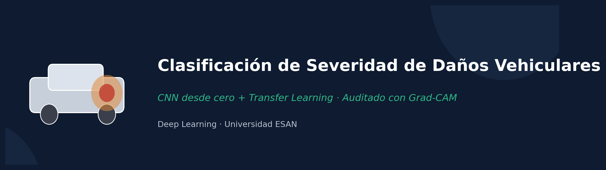
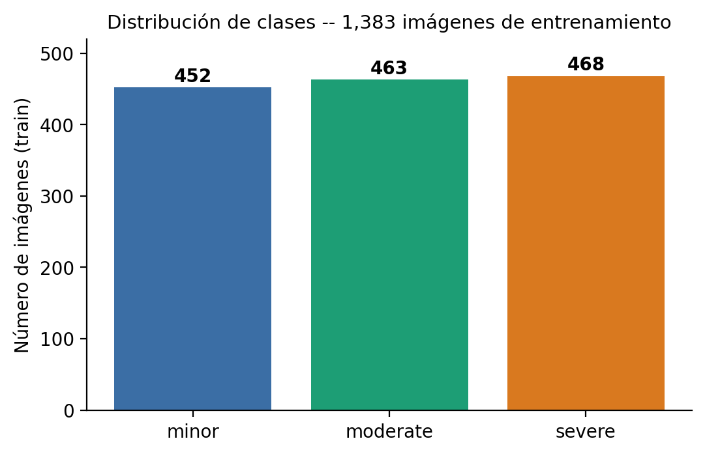
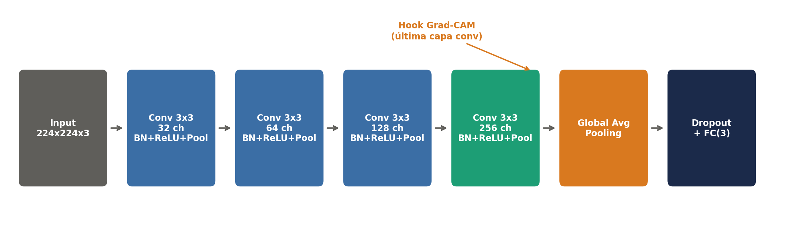
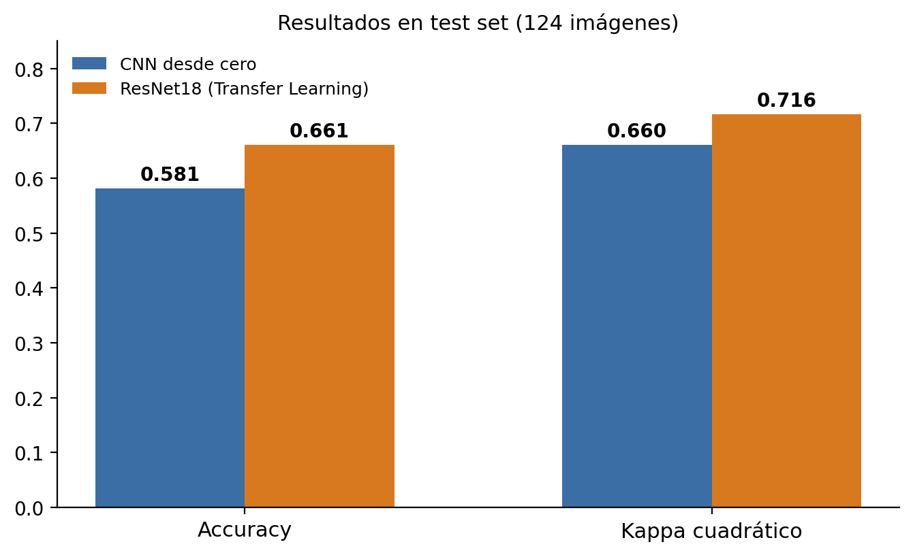
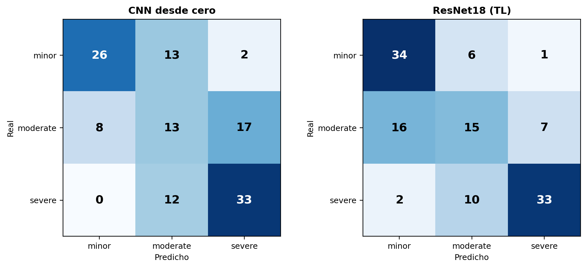
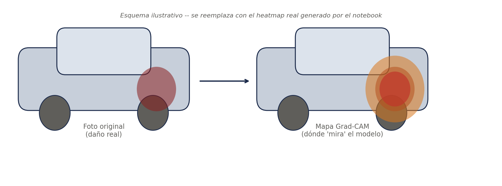

<div align="center">
  
</div>

<div align="center">

[](https://colab.research.google.com/github/TU-USUARIO/proyecto-final-dl-car-damage/blob/main/notebook/Proyecto_Final_DL_Car_Damage_Colab.ipynb)


**Diploma de Especialización en Data Analytics · Curso Deep Learning · Universidad ESAN**
Profesor: Javier Zárate

</div>

> ⚠️ **Antes de publicar este repo:** reemplaza `TU-USUARIO` en el badge "Open in Colab" de arriba por
> tu usuario real de GitHub, y sube las imágenes de `assets_para_github.zip` a una carpeta `assets/` en
> la raíz del repo. Sin esos dos pasos, el botón de Colab y las imágenes de este README no van a funcionar.
> Borra este aviso una vez que lo hayas hecho.

## 📑 Tabla de contenidos

- [Objetivo](#-objetivo)
- [Cumplimiento de la rúbrica](#-cumplimiento-de-la-rúbrica)
- [Fases del desarrollo](#-fases-del-desarrollo)
- [Los datos](#-los-datos)
- [Arquitectura](#-arquitectura)
- [Resultados principales](#-resultados-principales)
- [Explicabilidad (Grad-CAM)](#-explicabilidad-grad-cam)
- [Cómo correr el notebook](#-cómo-correr-el-notebook)
- [Limitaciones y trabajo futuro](#-limitaciones-y-trabajo-futuro)
- [Estructura del repositorio](#-estructura-del-repositorio)
- [Autores](#-autores)

---

## 🎯 Objetivo

Clasificar automáticamente la severidad de daños vehiculares (**minor / moderate / severe**) para
**triage de siniestros de seguros**: un CNN entrenado desde cero se compara contra ResNet18 (transfer
learning), y ambos se auditan con **Grad-CAM** antes de considerar cualquier despliegue — un modelo con
buen accuracy pero decisiones no explicables no es aceptable en un sistema que afecta pagos de seguros.

## ✅ Cumplimiento de la rúbrica

| Criterio de la rúbrica | Dónde se cumple | Evidencia |
|---|---|---|
| **Informe** — contextualiza el problema en Deep Learning | `informe/Informe_Proyecto_Final.pdf`, Sección 1 | Problema de negocio (triage), encuadre como clasificación + explicabilidad |
| **Implementación** — representación, arquitectura, entrenamiento, hiperparámetros justificados | Notebook, secciones de arquitectura y entrenamiento | Tabla de hiperparámetros con justificación, 2 arquitecturas comparadas |
| **Resultados** — métricas antes/después, comparación, limitaciones | Notebook + informe, Sección 3 | Accuracy, F1, Kappa cuadrático, matrices de confusión, Grad-CAM, limitaciones explícitas |

## 🧩 Fases del desarrollo

Todas las fases están en un solo notebook: [`notebook/Proyecto_Final_DL_Car_Damage_Colab.ipynb`](notebook/Proyecto_Final_DL_Car_Damage_Colab.ipynb)

| Fase | Secciones del notebook | Contenido |
|---|---|---|
| **1️⃣ Preprocesamiento de datos** | `Data` → `Pipeline de datos` | Carga del dataset (Kaggle), split train/val/test estratificado, Data Augmentation, `WeightedRandomSampler` |
| **2️⃣ Entrenamiento** | `Arquitectura A — CNN desde cero` → `Arquitectura B — ResNet18` → `Entrenamiento` | CNN desde cero (5 bloques + GAP), ResNet18 con fine-tuning gradual (3 etapas) |
| **3️⃣ Evaluación del modelo** | `Evaluación comparativa` → `Grad-CAM` → `Auditoría de negocio` | Accuracy, F1, Cohen's Kappa cuadrático, matrices de confusión, Grad-CAM desde cero |
| **4️⃣ Prueba del objetivo del trabajo** | `Probar el modelo con una imagen puntual` | Inferencia sobre una imagen (test set o subida por el usuario), con predicción + Grad-CAM en vivo |

<p align="center">
  
</p>

## 📊 Los datos

<p align="center">
  
</p>

- **1,383** imágenes de entrenamiento + **248** de validación/test (124 c/u).
- Dataset: [Car Damage Severity Dataset](https://www.kaggle.com/datasets/prajwalbhamere/car-damage-severity-dataset) (Kaggle).

<details>
<summary>⚠️ Ver limitación del dataset</summary>
<br>

Las fotos están curadas y bien encuadradas hacia el daño. Una foto real de un cliente (fondo, ángulo,
mala luz) es más difícil — el desempeño reportado aquí es un **techo optimista**, no una estimación de
desempeño en producción.
</details>

## 🏗️ Arquitectura

<p align="center">
  
</p>

<details>
<summary>🔍 ¿Por qué Global Average Pooling en vez de Flatten + Dense?</summary>
<br>

Es la arquitectura que Selvaraju et al. (2020) identifican como **caso especial de CAM**: los pesos de la
capa final se vuelven directamente interpretables como importancia por canal — el modelo se diseñó
pensando en explicabilidad desde el inicio, no como un añadido posterior.
</details>

<details>
<summary>🔍 ¿Por qué ResNet18 se entrena en 3 etapas (fine-tuning gradual)?</summary>
<br>

Descongelar todo el backbone desde la época 1 mete gradientes ruidosos de la capa final (recién
inicializada) hacia pesos preentrenados que ya eran buenos. Se entrena en 3 etapas: solo `fc` → se
descongela `layer4` → se descongela también `layer3`. Da más estabilidad que descongelar todo de golpe.
</details>

## 📈 Resultados principales

<p align="center">
  
  
</p>

| Métrica | CNN desde cero | ResNet18 (TL) |
|---|:---:|:---:|
| Accuracy | 58.1% | 66.1% |
| Cohen's Kappa (cuadrático) | 0.660 | 0.716 |

> **Hallazgo clave:** el CNN desde cero, aunque con menor accuracy, comete errores "baratos" (confunde
> clases adyacentes) y casi nunca errores "caros" (confundir minor con severe) — comportamiento esperable
> de un modelo que aprendió una representación razonable del problema pese a no tener el prior de ImageNet.

## 🔥 Explicabilidad (Grad-CAM)

<p align="center">
  
</p>

Grad-CAM se implementó **desde cero** (sin librerías de alto nivel), siguiendo Selvaraju et al. (2020),
para auditar si ambos modelos basan sus decisiones en la zona de daño real del vehículo o en
correlaciones espurias (fondo, marca, placa) — paso obligatorio antes de considerar cualquier uso en
un flujo real de triage de siniestros.

<details>
<summary>✅ Ver checklist de auditoría de negocio</summary>
<br>

| Pregunta | Resultado |
|---|---|
| ¿El modelo mira el daño real? | ✅ Sí, tras agregar un 5to bloque conv al CNN |
| ¿Hay correlaciones espurias (fondo, marca, placa)? | ✅ No detectadas en los ejemplos auditados |
| ¿Los errores son razonables? | ✅ Sí — suele mirar la zona correcta pero subestima el grado |
| ¿Auditoría exhaustiva de todo el test set? | ⚠️ Pendiente — solo se revisaron 2-3 ejemplos por modelo |
</details>

## ▶️ Cómo correr el notebook

1. Clic en el badge **"Open in Colab"** de arriba (o abre el `.ipynb` manualmente en Colab).
2. Activa GPU: `Runtime → Change runtime type → T4 GPU`.
3. Ejecuta celda por celda, en orden.
4. La sección `Data` imprime la estructura real del dataset descargado — verifícala antes de continuar
   (la ruta de Kaggle puede variar).

## ⚠️ Limitaciones y trabajo futuro

<details open>
<summary>Ver detalle</summary>
<br>

- **Validez externa:** dataset curado, no fotos reales de clientes.
- **Un solo split de test** (~124 imágenes): no se validó estabilidad con múltiples semillas o k-fold.
- **No implementado aún:** ensemble (CNN + ResNet18), Test-Time Augmentation, umbral de confianza/abstención.
- **Formulación categórica de un problema ordinal:** una extensión futura debería usar regresión ordinal
  (p. ej. CORAL) en vez de Cross-Entropy estándar.
</details>

## 📁 Estructura del repositorio

```
proyecto-final-dl-car-damage/
├── README.md
├── assets_para_github_2/                 <- imágenes usadas en este README
├── notebook/
│   └── Proyecto_Final_DL_Car_Damage_Colab.ipynb
├── informe/
│   └── Informe_Proyecto_Final.pdf
└── presentacion/
    └── Presentacion_Proyecto_Final.pdf
```

## 👥 Autores

| Integrante | Rol |
|---|---|
| Cesar Augusto Romero Aranda | — |
| Katiuska [Apellido] | — |
| Germán [Apellido] | — |
| Esteban [Apellido] | — |

---

<div align="center">

*Proyecto académico — Diploma de Especialización en Data Analytics, Universidad ESAN (2026)*

</div>
